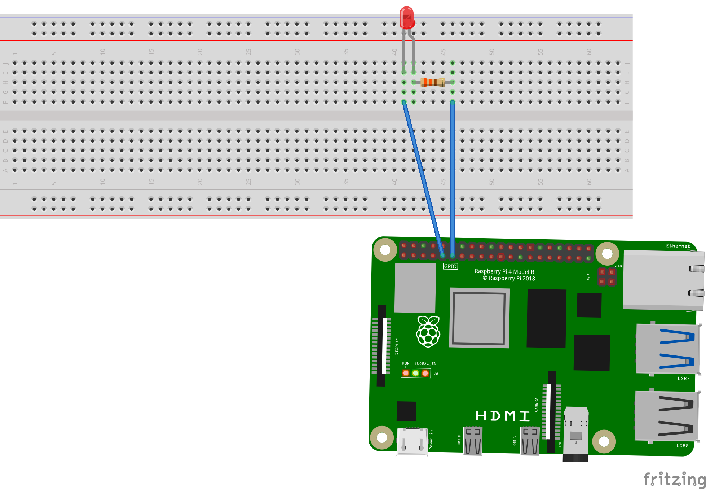

# LED点滅プログラム（C言語・Raspberry Pi）

このプロジェクトは、Raspberry PiでLEDを点滅させるC言語プログラムです。  
PythonでのGPIO制御に慣れていた中、C言語でも挑戦してみたいと思い、ChatGPTと一緒に1つずつ仕組みを理解しながら作成しました。

## 内容

- C言語とwiringPiライブラリを使って、GPIOピンを制御
- GPIO17番ピンに接続されたLEDを0.5秒間隔で点滅させます

- ## デモ動画 

LEDが0.5秒ごとに点滅する様子を撮影した動画です。  

 [https://www.youtube.com/watch?v=btwf-z2hbek)

※ ChatGPTと一緒に作りました

## 回路図（Fritzing）

以下はFritzingで作成したブレッドボード図です。

##　まとめ
今回からFritzingで作成したブレッドボード図を追加しました
RaspberryPiでgitを使ってgithubに直接アップロードしましたが、とても苦戦しました。
今回からvscodeを使っているので、gitを使ってアップロードする機会が増えると思うので、いずれは苦戦せずにできるようになりたいです

